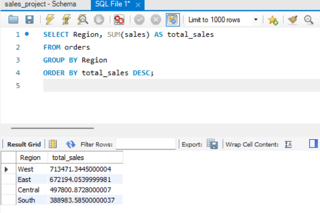
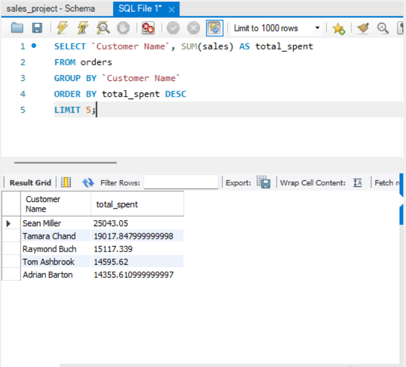
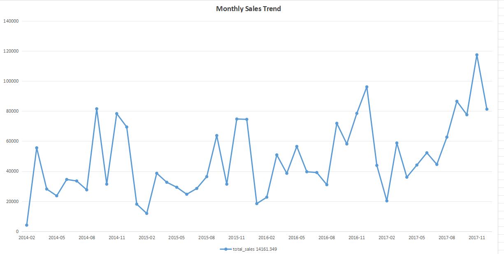
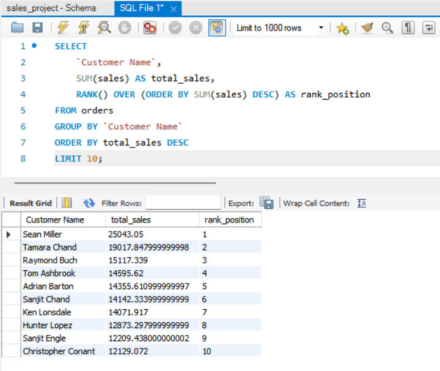

📊 SQL Data Analysis Project – E-commerce Dataset


🔍 Project Overview


This project analyses an e-commerce dataset using SQL to extract actionable insights on sales performance, customer behaviour, product trends, and operational efficiency.


🛠️ Tools & Technologies

* MySQL
* SQL


📂 Dataset Description


The dataset contains transactional sales data, including:

* Order details (Order ID, Order Date, Ship Date)
* Customer and segment information
* Product and category details
* Sales and profit metrics
* Shipping modes and regional data


🎯 Objectives

* Evaluate overall business performance
* Identify top-performing customers and products
* Analyse regional and category-wise sales
* Measure delivery efficiency
* Detect sales trends and seasonality


🚀 Project Highlights

* Performed end-to-end data analysis using SQL
* Extracted business insights from transactional data
* Applied advanced SQL techniques, including window functions
* Visualised trends using Excel for better interpretation


📈 Key SQL Analysis


🔹 Sales Performance - 

```sql

SELECT Region, SUM(sales) AS total_sales

FROM orders

GROUP BY Region

ORDER BY total_sales DESC;

```


🔹 Top Customers - 

```sql

SELECT `Customer Name`, SUM(sales) AS total_spent

FROM orders

GROUP BY `Customer Name`

ORDER BY total_spent DESC

LIMIT 5;

```


🔹 Monthly Sales Trend - 

```sql

SELECT 

    DATE_FORMAT(STR_TO_DATE(`Order Date`, '%m/%d/%Y'), '%Y-%m') AS month,

    SUM(sales) AS total_sales

FROM orders

GROUP BY month

ORDER BY month;

```


🔹 Customer Ranking (Advanced) - 

```sql

SELECT 

    `Customer Name`,

     SUM(sales) AS total_sales,

     RANK() OVER (ORDER BY SUM(sales) DESC) AS rank_position

FROM orders

GROUP BY `Customer Name`;

```


💡 Key Insights


* High-value customers contribute a significant portion of total revenue.
* Certain product categories generate high sales but relatively lower profit.
* Sales performance shows clear variation across regions, indicating uneven market distribution.
* Monthly analysis reveals seasonal sales trends.
* Standard shipping mode is most frequently used.
* Average delivery time provides insights into operational efficiency.


⚡ Advanced SQL Concepts Used


* Aggregation (SUM, COUNT, AVG)
* Grouping (GROUP BY, HAVING)
* Window Functions (RANK())
* Date Functions (STR\_TO\_DATE, DATEDIFF)
* Sorting and Filtering


📁 Project Structure


* analysis.sql → SQL queries for analysis
* README.md → Project documentation


📌 Key Takeaways

* Demonstrated ability to extract business insights using SQL
* Applied analytical thinking to identify trends and patterns
* Built a complete data analysis workflow from raw data to visualization


🔗 Conclusion


This project demonstrates the use of SQL to transform raw data into meaningful insights, showcasing analytical thinking and practical data analysis skills applicable in real-world business scenarios.


👤 Author


Aditya Raj

